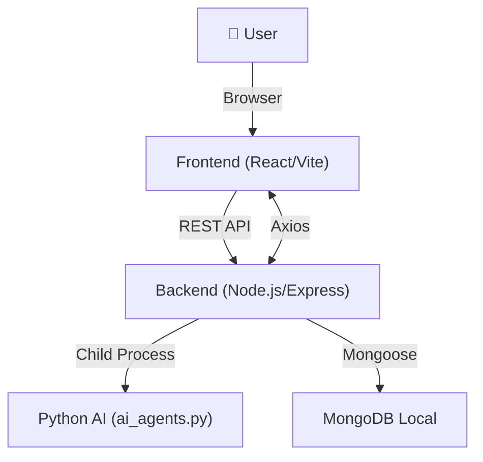

# 🚀 Company Researcher WebApp

A modern, full-stack web application for researching, tracking, and managing companies aligned with your career and business interests. Built with React, Node.js/Express, MongoDB, and Python AI integration.

---

## ✨ Features

- 🔐 **User Authentication** (email/password, JWT)
- 📝 **Company Notes Dashboard**: Create, edit, and manage notes
- 📄 **Resume Builder**: Generate and download professional resumes
- 🤖 **AI-Powered Insights**: Python-based AI for company analysis
- 📱 **Responsive UI**: Modern design with Tailwind CSS
- 👤 **Account Management**: Avatar upload, password change, and settings
- 🛠️ **Settings & Help Pages**
- 🌙 **Dark/Light Mode**
- 🏎️ **Fast, optimized performance**

---

## 🏗️ Tech Stack

**Frontend:**
- ⚛️ React 19 (Vite)
- 🎨 Tailwind CSS
- 🔗 React Router DOM
- 📡 Axios

**Backend:**
- 🟩 Node.js, Express.js
- 🍃 MongoDB (Mongoose)
- 🐍 Python (AI agents via `ai_agents.py`)
- 🌐 CORS enabled

**DevOps:**
- 🐙 GitHub (Version Control)

---

## 🗂️ Project Structure

```
webapp/
├── frontend/      # React app
│   └── src/
│       ├── components/
│       ├── pages/
│       └── ...
├── backend/       # Node.js/Express API & Python integration
│   ├── controllers/
│   ├── models/
│   ├── ai_agents.py
│   └── server.js
└── ...
```

---

## 🖼️ Architecture Diagram



---

## ⚙️ Local Setup & Installation

### 1. **Clone the Repository**
```sh
git clone <your-repo-url>
cd webapp
```

### 2. **Install Dependencies**
```sh
cd backend && npm install && pip install -r requirements.txt
cd ../frontend && npm install
```

### 3. **Environment Variables**
- **Never commit `.env` files to git!**
- Add `.env` to `.gitignore` (already done).
- Set environment variables on your deployment platform (Render, Vercel, etc).

#### Example `backend/.env`:
```
PORT=5000
MONGODB_URI=mongodb+srv://<user>:<pass>@cluster.mongodb.net/<dbname>
JWT_SECRET=your_jwt_secret
```

#### Example `frontend/.env`:
```
VITE_API_URL=https://your-backend.onrender.com
```

### 4. **Run Locally**

#### Backend
```sh
cd backend
npm start
```

#### Frontend
```sh
cd frontend
npm run dev
```

- Frontend: [http://localhost:5173](http://localhost:5173)
- Backend: [http://localhost:5000](http://localhost:5000)

---

## ☁️ Cloud Deployment Guide

### **Frontend (Vercel)**
1. Go to [Vercel](https://vercel.com/) and sign up.
2. Import your GitHub repo.
3. Set project root to `frontend/`.
4. **Build Command:** `npm run build`
5. **Output Directory:** `dist`
6. Add environment variables (e.g., `VITE_API_URL`).
7. Click **Deploy**. Get your public URL!

### **Backend (Render)**
1. Go to [Render](https://render.com/) and sign up.
2. Create a new **Web Service**.
3. Set root to `backend/`.
4. **Build Command:** `npm install && pip install -r requirements.txt`
5. **Start Command:** `node server.js`
6. Add environment variables (e.g., `MONGODB_URI`, `JWT_SECRET`).
7. Click **Create Web Service**. Get your backend URL!

---

## 🔒 Environment Variable Security
- `.env` files are **git-ignored** and must **never** be committed.
- Use your deployment platform's dashboard to set secrets.
- If secrets are ever exposed, **rotate them immediately**.

---

## 🧑‍💻 Usage Guide

1. **Register/Login** to access your dashboard.
2. **Dashboard**: Add, edit, and manage company notes.
3. **AI Insights**: Use AI features for company analysis.
4. **Resume Builder**: Build and download your resume.
5. **Account**: Upload avatar, change password, manage settings.
6. **Settings/Help**: Customize your experience and get support.

---

## 🛠️ Troubleshooting

- **MongoDB Connection Error:**
  - Ensure your `MONGODB_URI` is correct and points to MongoDB Atlas (not localhost).
- **CORS Issues:**
  - Backend must allow requests from your frontend domain.
- **Build Fails on Deploy:**
  - Check logs for missing dependencies or misconfigurations.
- **Environment Variables Not Working:**
  - Double-check spelling and redeploy after changes.

---

## 🤝 Contributing

1. Fork the repo
2. Create a new branch (`git checkout -b feature/your-feature`)
3. Commit your changes (`git commit -am 'Add new feature'`)
4. Push to the branch (`git push origin feature/your-feature`)
5. Open a Pull Request

---

## ❓ FAQ

**Q: Can I use a local MongoDB for production?**
> No, use MongoDB Atlas or another cloud provider for production deployments.

**Q: How do I add new AI features?**
> Extend `backend/ai_agents.py` and expose new endpoints in `server.js`.

**Q: How do I secure my API?**
> Use HTTPS, strong JWT secrets, and never expose secrets in the frontend.

**Q: Can I deploy both frontend and backend on the same platform?**
> Yes, but separating them (Vercel + Render) is recommended for scalability.

---

## 📝 License
ISC 
